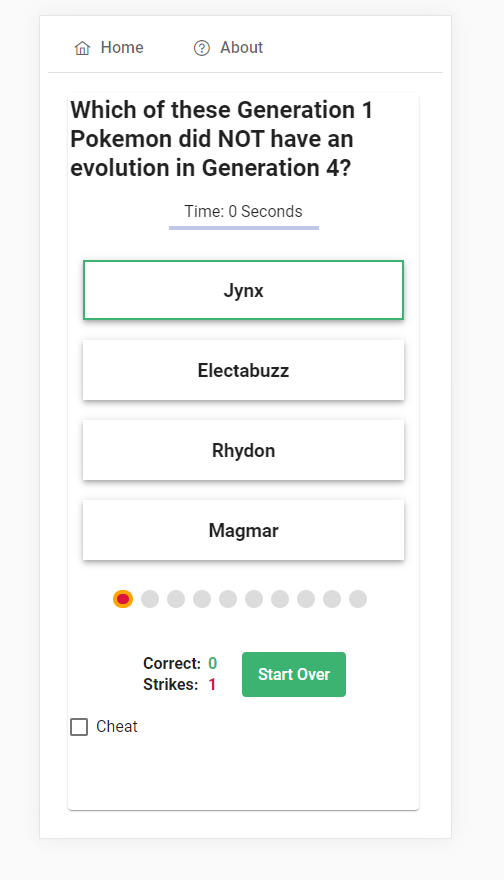

# Millionaire

An Angular implementation for "Who wants to be a millionaire"

## Running the project
```
git clone https://github.com/yarivgdidi/millionaire.git
cd millionaire
npm i
ng serve
http://localhost:4200/

```



see also live demo [here](http://millionaire.app.s3-website.eu-central-1.amazonaws.com)
